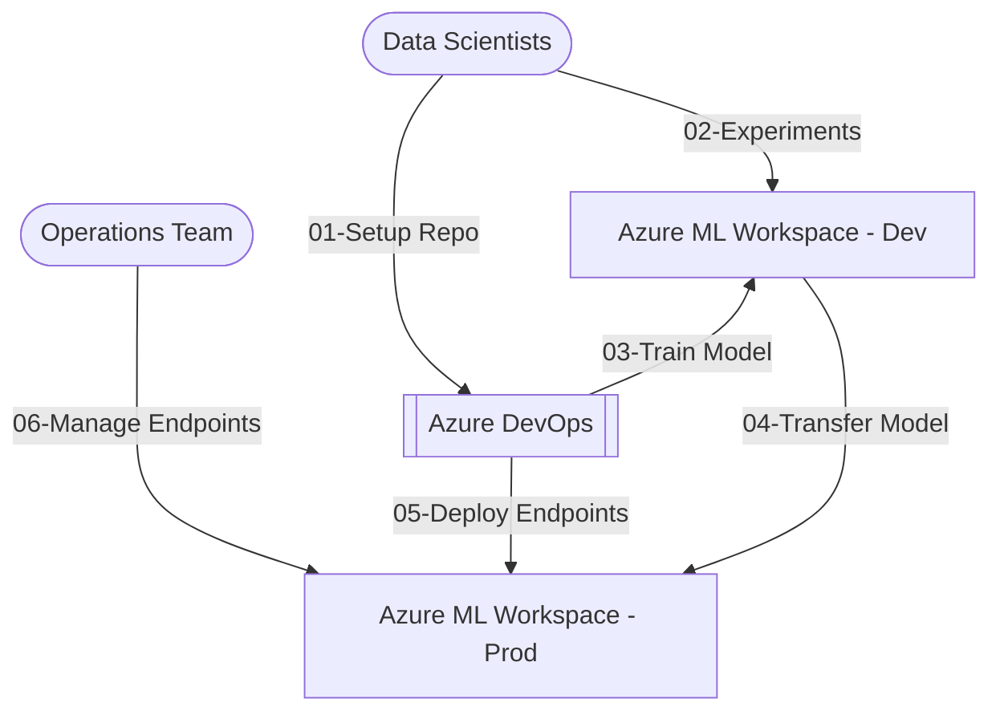

# DevOps For Machine Learning | MLOps


## References

1. [Azure resource naming convention](https://learn.microsoft.com/en-us/azure/cloud-adoption-framework/ready/azure-best-practices/resource-naming)
# DevOps Repository Guide for Data Scientists

Welcome to the DevOps repository for organizing the Data Scientist team. This guide will help you understand the repository structure, branching strategy, and the steps to effectively contribute to the project.

## Table of Contents

- [Introduction](#introduction)
- [Repository Structure](#repository-structure)
- [Branching Strategy](#branching-strategy)
  - [Main Branch](#main-branch)
  - [Experiment Branches](#experiment-branches)
- [Working on Experiment Branches](#working-on-experiment-branches)
  - [1. Creating a New Experiment Branch](#1-creating-a-new-experiment-branch)
  - [2. Adding Feature Engineering and Model Training Components](#2-adding-feature-engineering-and-model-training-components)
    - [Writing Test Cases](#writing-test-cases)
  - [3. Defining ML Pipelines](#3-defining-ml-pipelines)
  - [4. Building and Deploying DevOps Pipelines](#4-building-and-deploying-devops-pipelines)
- [Best Practices](#best-practices)
- [Conclusion](#conclusion)
- [FAQs](#faqs)
- [Contacts](#contacts)

## Introduction

This repository is designed to streamline the collaboration between data scientists by organizing code, pipelines, and environments effectively. The main branch contains common code and resources, while experiment branches allow for isolated development of new features and models.



## Repository Structure

- **`main` branch**: Contains common resources such as:
  - Pipeline definitions
  - ML pipeline components
  - ML pipeline environment definitions
  - Common scripts

- **`<experiment>_main` branches**: Dedicated branches for each experiment, derived from the `main` branch.

## Branching Strategy

### Main Branch

The `main` branch serves as the central repository for shared resources. It should remain stable and contain only the code that is common to all experiments.

### Experiment Branches

For each new experiment:

- Create a new branch from `main` named `<experiment>_main`.
- Isolate changes specific to the experiment in this branch.
- Cherry-pick changes back to `main` only when changes are intended to be shared across all experiments.

## Working on Experiment Branches

### 1. Creating a New Experiment Branch

To start a new experiment:

```bash
git checkout main
git pull origin main
git checkout -b <experiment>_main
```

Replace `<experiment>` with the name of your experiment.

### 2. Adding Feature Engineering and Model Training Components

Develop your feature engineering and model training code within the experiment branch:

- Create directories as needed, e.g., `./src/components/preprocessing/`, `./src/components/training/`.
- Ensure modularity and reusability of code.
- Remember that all code associated with a component should be within the same folder

#### Writing Test Cases

- For every new component, write corresponding test cases.
- Place test scripts in a `./tests/` directory.
- Use testing frameworks like `unittest`, `pytest`, etc.

Example:

```python
# tests/test_feature_engineering.py

import unittest
from feature_engineering import transform_data

class TestFeatureEngineering(unittest.TestCase):
    def test_transform_data(self):
        # Write test cases here
        pass

if __name__ == '__main__':
    unittest.main()
```

### 3. Defining ML Pipelines

- Create folder `./src/pipelines/` for managing all the training ML pipelines. 
- Define your ML pipelines in configuration files or scripts within the experiment branch.
- Use standardized formats (e.g., YAML, JSON) for pipeline definitions.
- Ensure compatibility with the common pipeline components in the `main` branch.

Example pipeline definition:

```yaml
# pipeline.yaml

steps:
  - name: data_preprocessing
    script: ./src/components/preprocessing/feature_engineering.py
  - name: model_training
    script: ./src/components/training/train.py
  - name: evaluation
    script: ./src/components/evaluation/evaluate.py
```

### 4. Building and Deploying DevOps Pipelines

- Configure DevOps pipelines to automate building, testing, and deployment.
- Use tools like Jenkins, GitHub Actions, or Azure DevOps.

Example GitHub Actions workflow:

```yaml
# .github/workflows/ci-cd.yml

name: CI/CD Pipeline

on:
  push:
    branches: [ '<experiment>_main' ]

jobs:
  build:
    runs-on: ubuntu-latest
    steps:
      - uses: actions/checkout@v2
      - name: Set up Python
        uses: actions/setup-python@v2
        with:
          python-version: '3.8'
      - name: Install Dependencies
        run: pip install -r requirements.txt
      - name: Run Tests
        run: pytest tests/
      - name: Deploy
        run: ./deploy.sh
```

## Best Practices

- **Code Quality**: Follow PEP 8 guidelines for Python code.
- **Version Control**: Commit changes frequently with meaningful messages.
- **Documentation**: Document your code and pipelines thoroughly.
- **Collaboration**: Communicate with team members about changes that might affect others.

## Conclusion

By following this guide, you'll contribute effectively to the repository and ensure smooth collaboration within the team. Always keep the `main` branch clean and use experiment branches for development.

## FAQs

**Q1: When should I merge my experiment branch back to `main`?**

A1: Only when the changes are intended to be shared across all experiments or have become common utilities.

**Q2: How do I handle dependencies specific to my experiment?**

A2: Manage experiment-specific dependencies within your branch and update `requirements.txt` accordingly.


## References

1. [Azure resource naming convention](https://learn.microsoft.com/en-us/azure/cloud-adoption-framework/ready/azure-best-practices/resource-naming)
